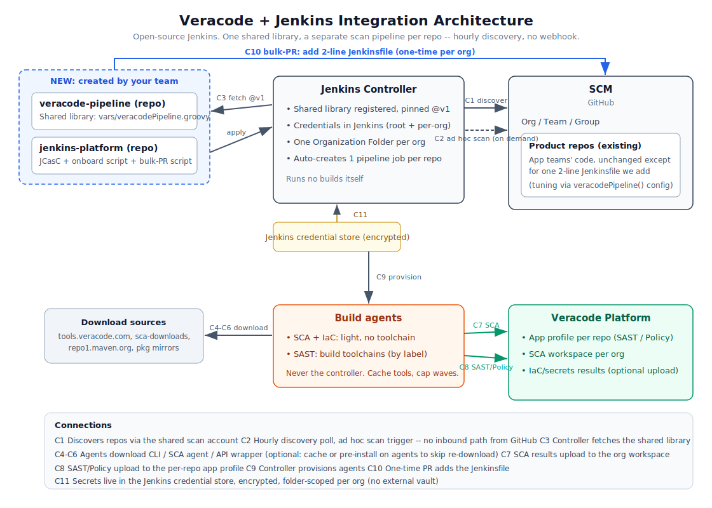

# Veracode Security Pipeline for Jenkins

Automated Veracode security scanning across GitHub organizations, delivered as a Jenkins Shared Library. Drop a 2-line `Jenkinsfile` into any repo and it gets SCA, IaC/secrets, and SAST, beside the team's existing build.

> **Discovery runs hourly; scans stay ad hoc.** No webhook is configured (see "Trigger model" below). Jenkins polls GitHub every hour to discover new repos and branches, but a scan only happens when someone explicitly triggers it via the Jenkins UI, `trigger-scan.sh` / `trigger-scan.ps1`, or the automatic first build of a newly discovered repo's default branch.

<p align="center">
  
</p>

---

## What it does

Every repo that opts in gets three scans available, run on demand:

| Scan | When | What it covers |
|------|------|----------------|
| **SCA** (Software Composition Analysis) | Ad hoc, default branch + PRs | Open source dependencies and license risk |
| **IaC + Secrets** | Ad hoc, default branch + PRs | Infrastructure misconfigurations and hardcoded secrets |
| **SAST + Policy** | Ad hoc, default branch only | First-party code, compiled and scanned against your Veracode policy |

A plain feature branch with no open PR is not scanned by default. Opt a repo into scanning every feature branch push with `veracodePipeline(scanFeatureBranches: true)`.

Scans run on a dedicated pipeline beside each team's build. No changes to existing CI. No risk to existing deployments. The only thing added to a product repo is a 2-line `Jenkinsfile`.

## Trigger model

- **No webhook.** Jenkins never receives an inbound call from GitHub (`manageHooks=false`).
- **Hourly discovery poll.** Each org folder re-indexes every hour (`PeriodicFolderTrigger`, set by `veracode-onboard.groovy`). This is Jenkins reaching out to the GitHub API (egress), not GitHub calling in. New repos with a `Jenkinsfile` and new branches are picked up within the hour without anyone clicking a button.
- **Builds stay scoped.** `NoTriggerOrganizationFolderProperty` still applies: on any discovery pass (hourly or manual), only `main`/`master` gets auto-queued for a newly discovered repo. Feature branches and PRs are registered as jobs but never auto-built.

Every other build is explicitly requested, either from the Jenkins UI ("Scan Organization Now" / "Scan Repository Now" / "Build Now") or by running `trigger-scan.sh` / `trigger-scan.ps1` (`platform-automation/`) from somewhere with network access to Jenkins. See `SOLUTION.md` section 6 for the full trigger reference.

---

## How it works

```
GitHub org
  └── repo (any language)
        └── Jenkinsfile          ← 2 lines, added by PR
              │
              ▼
     Jenkins Organization Folder  ← auto-discovers repos via GitHub API, hourly
              │
              ▼
     veracode-pipeline library    ← all logic lives here, versioned by Git tag
              │
         ┌────┴────────────────┐
         ▼                     ▼
    SCA + IaC/Secrets        SAST (default branch)
    (every build)            Docker container auto-detects
                             language, compiles, packages,
                             uploads to Veracode platform
```

The shared library handles everything: Veracode CLI install, SCA agent download, Docker-based autopackaging, Java wrapper upload, GitHub commit status reporting. Repos stay clean.

---

## Rollout in 5 steps

1. **Run `rollout.py`** - creates the two platform repos, registers the library in Jenkins, configures credentials, runs onboarding
2. **Scan Organization** in Jenkins - discovers all repos in the org now; after that, discovery repeats automatically every hour
3. **Merge Jenkinsfile PRs** - `bulk_add_jenkinsfile.py` opens them, teams merge them
4. **Trigger a scan** - Jenkins UI ("Scan Organization Now" / "Scan Repository Now" / "Build Now") or `trigger-scan.sh` / `trigger-scan.ps1`; nothing scans automatically
5. Results appear in the Veracode platform after each ad hoc scan

The entire rollout touches no existing build pipelines and is reversible: `bulk_add_jenkinsfile.py --delete` opens PRs to remove the `Jenkinsfile` from every repo.

---

## Repository layout

```
library-repo/               → push as "veracode-pipeline" repo, tag v1
  vars/veracodePipeline.groovy    full pipeline: SCA, IaC, SAST (Linux + Windows)
  README.md                       usage, overrides, versioning, agent setup

platform-automation/        → push as "jenkins-platform" repo
  rollout.py / .sh / .ps1         one-shot setup script, three equivalent variants (dummy values, safe to commit)
  veracode-onboard.groovy         creates org folders, mints SCA tokens, hourly discovery poll
  bulk_add_jenkinsfile.py         bulk PR rollout across orgs (--delete to reverse)
  trigger-scan.sh / .ps1          ad hoc scan trigger (org / repo / branch), the CLI equivalent of the Jenkins UI buttons
  jenkins.casc.yaml               JCasC alternative to rollout.py steps 2-3
  bind-sca-tokens.groovy          legacy, superseded by veracode-onboard.groovy
  orgfolders.jobdsl.groovy        legacy, superseded by veracode-onboard.groovy
  README.md                       step-by-step manual guide

consumer-repo-files/        → added to each scanned repo by the bulk-PR script
  Jenkinsfile                     2 lines
```

Per-repo tuning (source dir, app name, custom build steps, library version) is done directly in that repo's `Jenkinsfile` via `veracodePipeline(...)` config, not a separate config file. See `library-repo/README.md` for the full option list.

---

## What changes in your environment

| | Before | After |
|---|---|---|
| Product repos | Unchanged | +1 `Jenkinsfile` (2 lines) |
| Jenkins | Unchanged | +1 shared library, +1 org folder per scanned org |
| GitHub | Unchanged | +2 platform repos (no webhook -- Jenkins is never called into automatically; it polls hourly for discovery, scans stay ad hoc) |
| Veracode | Unchanged | +1 app profile per repo, +1 SCA workspace per org |

No agents are replaced. No existing pipelines are modified. No credentials are stored outside Jenkins.

---

## Requirements

- Jenkins with the Pipeline, GitHub Branch Source, Credentials Binding, and Docker Workflow plugins
- A GitHub PAT with `repo` and `read:org` scopes for the scan service account
- Veracode API credentials (ID + Key)
- Docker on Jenkins agents for SAST autopackaging (or pre-installed language toolchains)

See `SOLUTION.md` for the full architecture, credential scoping, agent requirements, and phased rollout plan.
